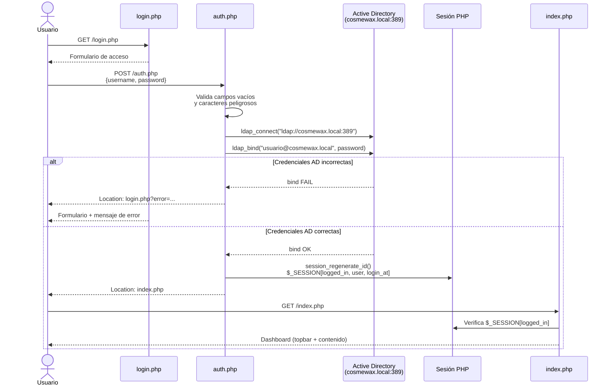
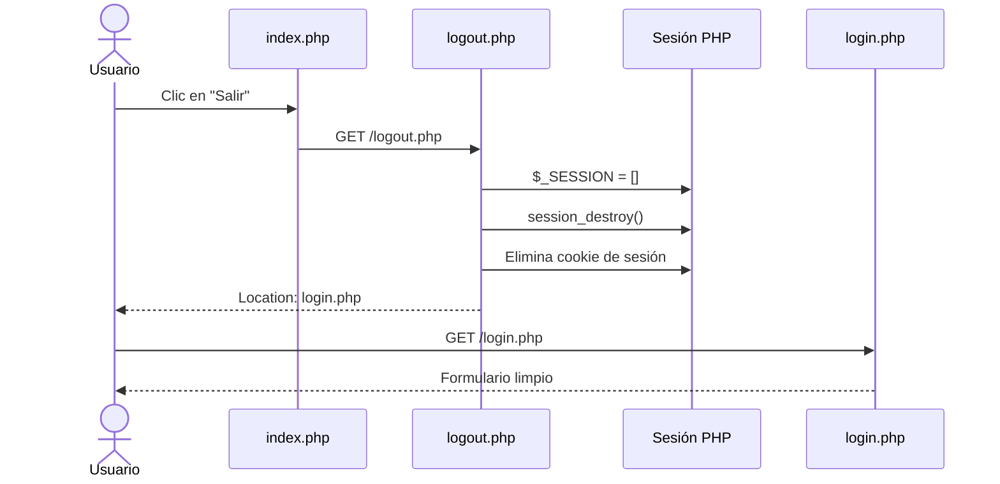
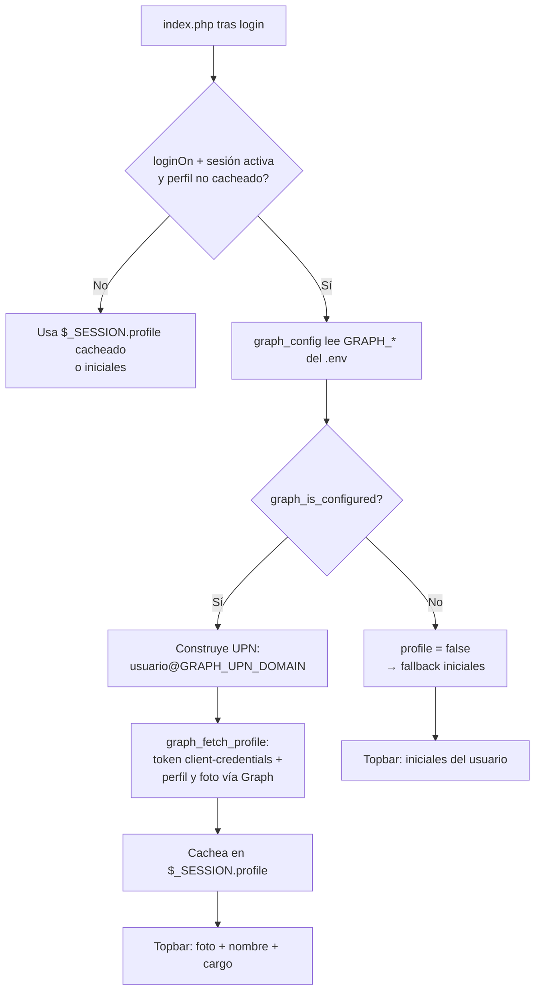
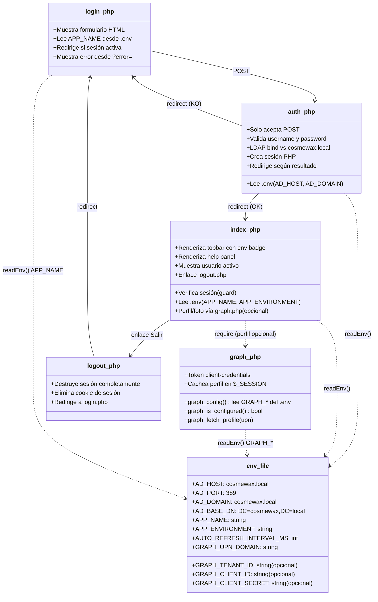
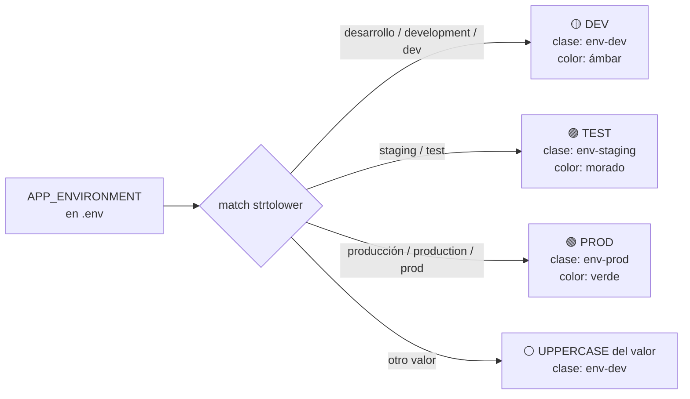

# Arquitectura — EsqueleticPHP

Documentación técnica del esqueleto base para aplicaciones PHP internas de Cosmewax.

---

## Flujo de autenticación

**Ejemplo real:**
- Input: usuario `soporteit`, contraseña de red Windows
- `auth.php` construye UPN: `soporteit@cosmewax.local`
- Bind LDAP en `cosmewax.local:389` → OK
- Si OK → `$_SESSION['user'] = 'soporteit'` → redirect a `index.php`

---

## Flujo de cierre de sesión

---

## Foto de perfil en la topbar (Microsoft Graph)

Feature **opcional**: si el `.env` trae credenciales `GRAPH_*`, la topbar muestra la foto de perfil real, el nombre para mostrar y el cargo del usuario autenticado (leídos de Microsoft 365 / Entra ID). Si faltan, cae al fallback de iniciales sin romper nada. La lógica reutilizable vive en `graph.php`; el sub-proyecto `FotoPerfil/` es una prueba de concepto aislada de la misma idea.

**Ejemplo real:**
- Input: usuario de sesión `dmanjon`, `GRAPH_UPN_DOMAIN=cosmewax.com`
- UPN construido: `dmanjon@cosmewax.com`
- `graph_fetch_profile` → `{name, jobTitle, photo (data URI)}` → cacheado en `$_SESSION['profile']`
- Output: topbar con foto circular + nombre + cargo
- Si `GRAPH_CLIENT_SECRET` está vacío → `profile = false` → topbar con iniciales `DM`

**Seguridad:** la foto se consulta **solo para el usuario de la sesión** y se cachea en `$_SESSION` (una llamada por sesión, no por carga). No hay endpoint público que permita volcar la foto de otros usuarios del tenant.

---

## Estructura de componentes

---

## Badge de entorno

---

## Active Directory — Servidores LDAP

| Servidor                   | Sitio         | Rol |
|----------------------------|---------------|-----|
| `CMW0010.cosmewax.local`   | SITIOJEREZ    | PDC |
| `CMWSCD0001.cosmewax.local`| SITIOVALENCIA |     |
| `CMWPZ0001.cosmewax.local` | SITIOPUZOL    |     |
| `CMWPZ0010.cosmewax.local` | SITIOPUZOL    |     |

Usando `AD_HOST=cosmewax.local`, el DNS del dominio reparte la carga entre los DCs disponibles automáticamente.

---

## CSS — Variables corporativas

Definidas en `css/index.css`:

| Variable              | Valor     | Uso                          |
|-----------------------|-----------|------------------------------|
| `--corp-primary`      | `#587587` | Topbar, botones, acentos     |
| `--corp-primary-dark` | `#46606F` | Hover de botones             |
| `--corp-primary-light`| `#7A95A6` | Iconos, textos secundarios   |
| `--corp-bg`           | `#F0F2F5` | Fondo general de la página   |
| `--corp-bg-soft`      | `#F8F9FB` | Fondos de secciones/cards    |
| `--corp-text`         | `#1A202C` | Texto principal              |
| `--corp-text-soft`    | `#6B7888` | Texto secundario/placeholders|
| `--corp-border`       | `#E2E5EB` | Bordes de cards y tablas     |
